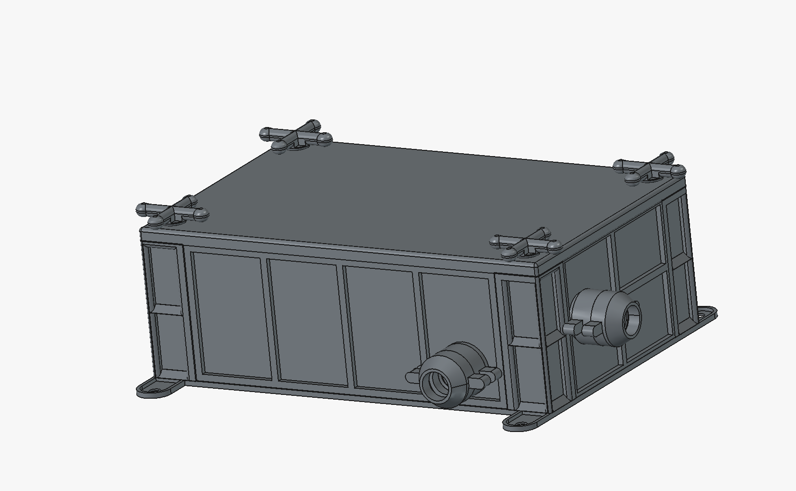
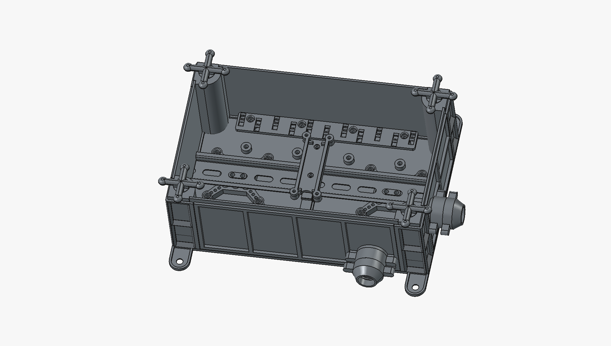
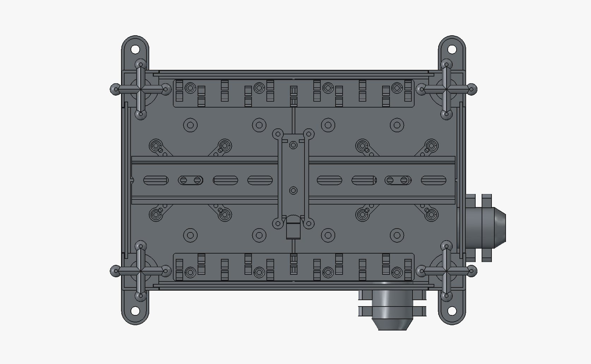
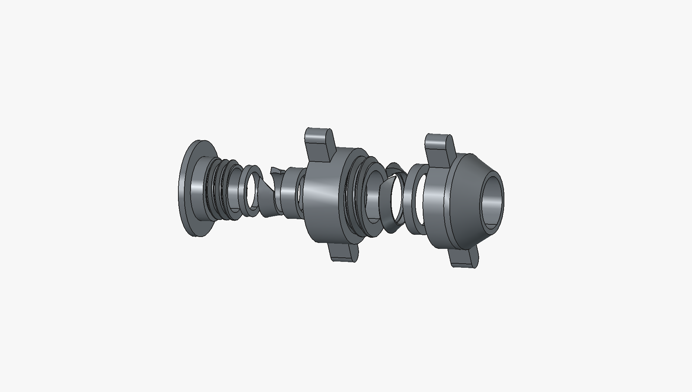
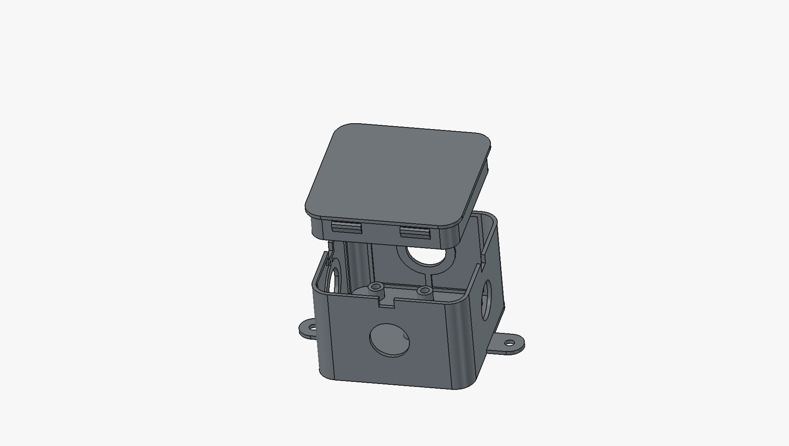
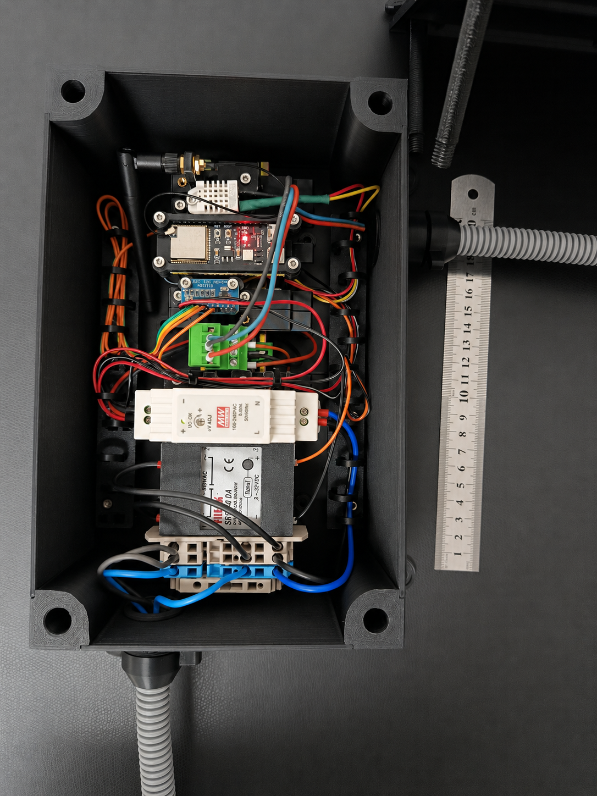
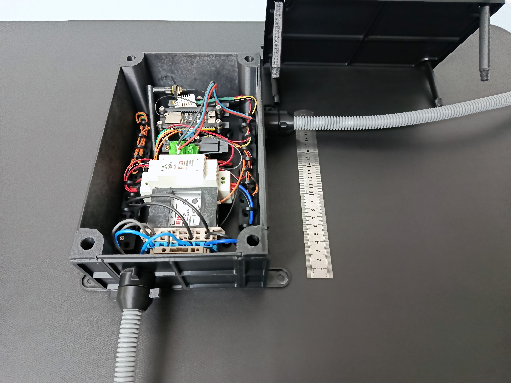
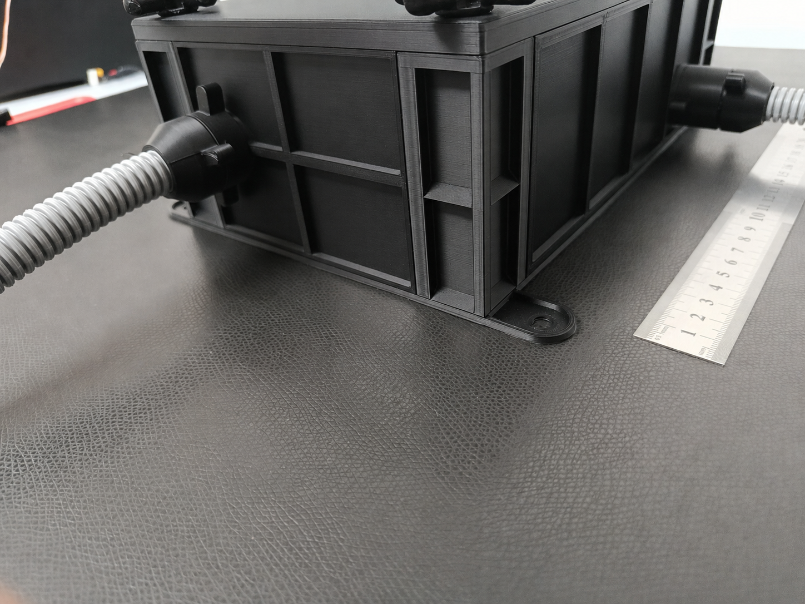

# basic_dinrail_case

A 3D-printable enclosure for FDM printing – fully tested, including 3D-printed screw fittings. The enclosure has a modular design, so the side panels can easily be adapted, e.g. for cable glands, displays, or other purposes.

## Dimensions

| Measurement | Value |
| --- | --- |
| Outer dimensions | 250 mm × 210 mm |
| Usable interior space | 237 mm × 147 mm × 85 mm |
| Mounting | 4 screw holes (Ø 6.4 mm), one at each corner |

## Interior

The interior contains several bosses for brass threaded heat-set inserts, for mounting components, modules, or a DIN rail (TS35, 235 mm long – space for up to 13 standard modules of 18 mm width). In addition, cable holders can be mounted along the edges.

## Design

The enclosure consists of:

- **4 corner modules**
- **4 side panels** (2 long and 2 shorter ones) that slide into recesses
- **1 lid** that also slides into a side recess and is fastened with 4 3D-printable screws

The screws can be printed lying flat (offset) and withstand the load when being tightened.

## Small junction box

The small enclosure serves solely as a junction box for extending or branching cables.

## Photos

## Files

| File | Contents |
| --- | --- |
| `case_*.png`, `small_case.png`, `empty_conduit_fitting.png` | Renderings of the CAD design used in this README |
| `real1.png`, `real2.jpg`, `real3.png` | Photos of the printed and assembled enclosure |

The FreeCAD source document is not published in this repository — it is
available on request.

## License

This project is released under the [MIT License](LICENSE.md).

Copyright (c) 2026 Sascha G. Eurich, Melowsyne UNIPESSOAL LDA
